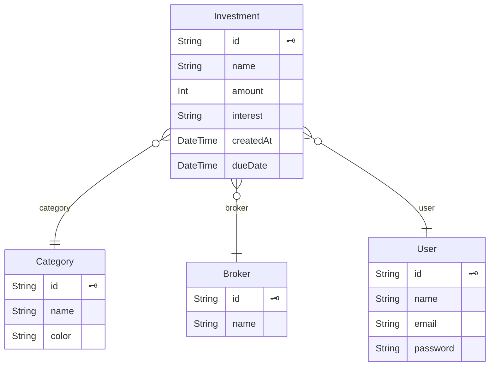

```mermaid
erDiagram

  "Investment" {
    String id "🗝️"
    String name 
    Int amount 
    String interest 
    DateTime createdAt 
    DateTime dueDate 
    }
  

  "Category" {
    String id "🗝️"
    String name 
    String color 
    }
  

  "Broker" {
    String id "🗝️"
    String name 
    }
  

  "User" {
    String id "🗝️"
    String name 
    String email 
    String password 
    }
  
    "Investment" }o--|| "Category" : "category"
    "Investment" }o--|| "Broker" : "broker"
    "Investment" }o--|| "User" : "user"
```
